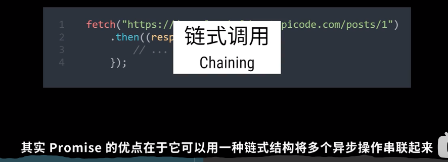
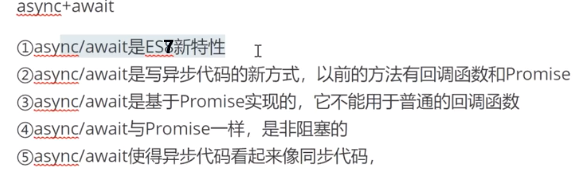
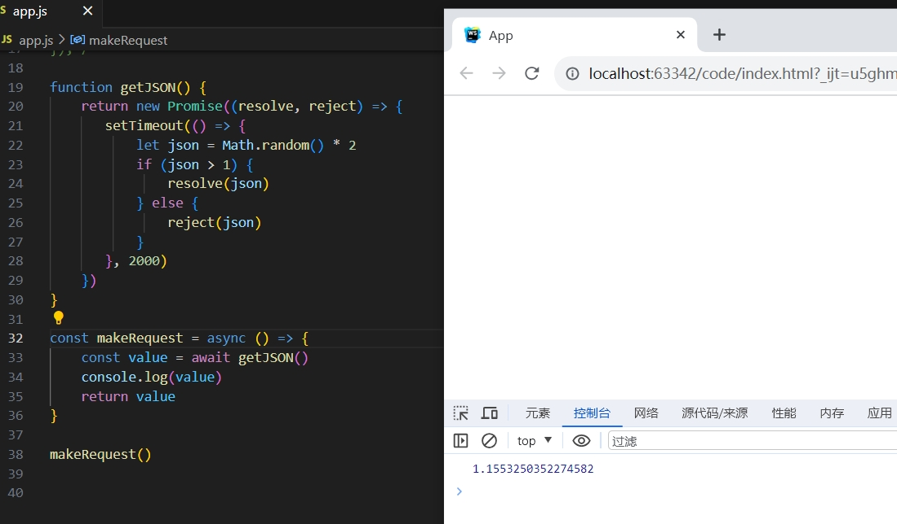
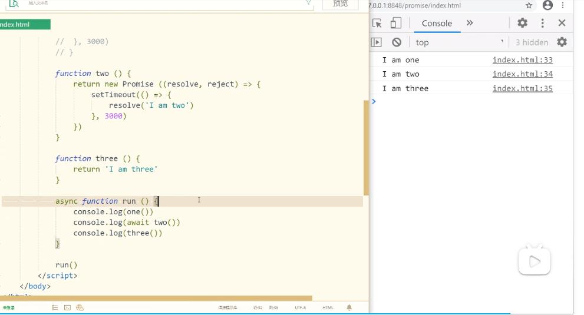
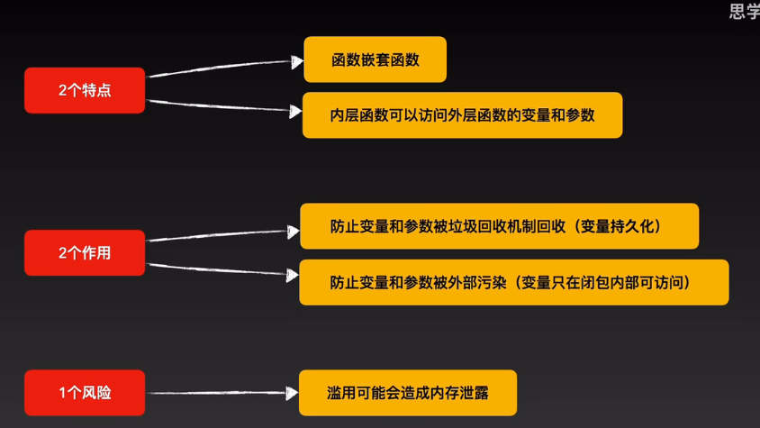

## JavaScript基础(深人)
高级知识

## Promise
https://developer.mozilla.org/zh-CN/docs/Web/JavaScript/Reference/Global_Objects/Promise



Promise 很棒的一点就是**链式调用**（**chaining**）

现在我们新建一个 Promise 对象：

```javascript
new Promise(function (resolve, reject) {
    // 要做的事情...
});
```

通过新建一个 Promise 对象好像并没有看出它怎样 "更加优雅地书写复杂的异步任务"。我们之前遇到的异步任务都是一次异步，
如果需要多次调用异步函数呢？例如，如果我想分三次输出字符串，第一次间隔 1 秒，第二次间隔 4 秒，第三次间隔 3 秒：**（问题 嵌套太复杂）**

```javascript
setTimeout(function () {
    console.log("First");
    setTimeout(function () {
        console.log("Second");
        setTimeout(function () {
            console.log("Third");
        }, 3000);
    }, 4000);
}, 1000);
```

这段程序实现了这个功能，但是它是用 "函数瀑布" 来实现的。可想而知，在一个复杂的程序当中，
用 "函数瀑布" 实现的程序无论是维护还是异常处理都是一件特别繁琐的事情，而且会让缩进格式变得非常冗赘。
现在我们用 Promise 来实现同样的功能：

```javascript
new Promise(function (resolve, reject) {
    setTimeout(function () {
        console.log("First");
        resolve();
    }, 1000);
}).then(function () {
    return new Promise(function (resolve, reject) {
        setTimeout(function () {
            console.log("Second");
            resolve();
        }, 4000);
    });
}).then(function () {
    setTimeout(function () {
        console.log("Third");
    }, 3000);
});
```

这段代码较长，所以还不需要完全理解它，我想引起注意的是 Promise 将嵌套格式的代码变成了顺序格式的代码。

###### 总结  链式调用 多个异步操作串联起来

```javascript
一个 Promise 必然处于以下几种状态之一：
 待定（pending）：初始状态，既没有被兑现，也没有被拒绝。
 已兑现（fulfilled）：意味着操作成功完成。
 已拒绝（rejected）：意味着操作失败。

Promise的链式调用
Promise.prototype.then()、Promise.prototype.catch() 和 Promise.prototype.finally() 方法用于将进一步的操作与已敲定的 Promise 相关联。由于这些方法返回 Promise，因此它们可以被链式调用。
.then() 方法最多接受两个参数；第一个参数是 Promise 兑现时的回调函数，第二个参数是 Promise 拒绝时的回调函数。每个 .then() 返回一个新生成的 Promise 对象，这个对象可被用于链式调用
```

下面是一个使用 Promise 构造函数创建 Promise 对象的例子：
当 Promise 被构造时，起始函数会被同步执行：

```javascript
// resolve 解决时调用
// reject  拒绝时调用
const promise = new Promise((resolve, reject) => {
  // 异步操作
  setTimeout(() => {
    if (Math.random() < 0.5) {
      resolve('success');
    } else {
      reject('error');
    }
  }, 1000);
});

promise.then(result => {
  console.log(result);
}).catch(error => {
  console.log(error);
});

这段程序会直接输出 error 或 success
```

在上面的例子中，我们使用 Promise 构造函数创建了一个 Promise 对象，并使用 setTimeout 模拟了一个异步操作。如果异步操作成功，
则调用 resolve 函数并传递成功的结果；如果异步操作失败，则调用 **reject** 函数并传递失败的原因。
然后我们使用 **then** 方法处理 Promise 成功状态的回调函数，使用 catch 方法处理 Promise 失败状态的回调函数。

resolve 和 reject 都是函数，其中调用 resolve 代表一切正常，reject 是出现异常时所调用的

## async

async 是 ES7 才有的与异步操作有关的关键字，和 Promise ， Generator 有很大关联的

async 函数是使用`async`关键字声明的函数。async 函数是 [`AsyncFunction`](https://developer.mozilla.org/zh-CN/docs/Web/JavaScript/Reference/Global_Objects/AsyncFunction) 构造函数的实例，并且其中允许使用 `await` 关键字。`async` 和 `await` 关键字让我们可以用一种更简洁的方式写出基于 [`Promise`](https://developer.mozilla.org/zh-CN/docs/Web/JavaScript/Reference/Global_Objects/Promise) 的异步行为，而无需刻意地链式调用 `promise`。

async 函数还可以被[作为表达式](https://developer.mozilla.org/zh-CN/docs/Web/JavaScript/Reference/Operators/async_function)来定义。

```javascript
function resolveAfter2Seconds() {
  return new Promise((resolve) => {
    setTimeout(() => {
      resolve('resolved');
    }, 2000);
  });
}

async function asyncCall() {
  console.log('calling');
  const result = await resolveAfter2Seconds();
  console.log(result);
  // Expected output: "resolved"
}

asyncCall();
```

###### 语法

```javascript
async function name([param[, param[, ... param]]]) { statements }
name: 函数名称。
param: 要传递给函数的参数的名称。
statements: 函数体语句。
```

async 函数返回一个 Promise 对象，可以使用 then 方法添加回调函数。

```javascript
async function helloAsync(){
    return "helloAsync";
}

console.log(helloAsync()) // Promise {<resolved>: "helloAsync"}

helloAsync().then(v=>{
   console.log(v); // helloAsync
})
```

## await

await 操作符用于等待一个 Promise 对象, 它只能在异步函数 async function 内部使用。

###### 语法

```javascript
[return_value] = await expression;
```

返回 Promise 对象的处理结果。如果等待的不是 Promise 对象，则返回该值本身。

如果一个 Promise 被传递给一个 await 操作符，await 将等待 Promise 正常处理完成并返回其处理结果。

```javascript
function testAwait (x) {
  return new Promise(resolve => {
    setTimeout(() => {
      resolve(x);
    }, 2000);
  });
}

async function helloAsync() {
  var x = await testAwait ("hello world");
  console.log(x);
}
helloAsync ();
// hello world
```

正常情况下，await 命令后面是一个 Promise 对象，它也可以跟其他值，如字符串，布尔值，数值以及普通函数。

```javascript
function testAwait(){
   console.log("testAwait");
}
async function helloAsync(){
   await testAwait();
   console.log("helloAsync");
}
helloAsync();
// testAwait
// helloAsync
```

await针对所跟不同表达式的处理方式：

- Promise 对象：await 会暂停执行，等待 Promise 对象 resolve，然后恢复 async 函数的执行并返回解析值。
- 非 Promise 对象：直接返回对应的值。









https://www.bilibili.com/video/BV1rK4y1J7dm/

https://www.bilibili.com/video/BV1NT411s7SR/

## 闭包

[闭包 - JavaScript | MDN (mozilla.org)](https://developer.mozilla.org/zh-CN/docs/Web/JavaScript/Closures)

```javascript
闭包本质就是：
嵌套的内部函数使用了外层函数的变量，这个被使用的变量就不会被GC（垃圾回收），而是持久化在内存中（会造成内存泄漏风险）。
因此，每次调用内部函数 都可以操作这个变量。

面试问你就说：
内部访问外部，好处是防止垃圾回收机制，坏处就是容易造成内存泄露，只要有这个好处就一定有这个坏处，
所谓防止被回收就是一直可用，所谓内存泄露就是后来没用过，但是一直被保存，导致内存一直占用
```

## ES6

ES6 Symbol
JavaScript新的原始类型Symbol，我们可以使用`Symbol`来创建唯`一值`作为`对象属性`或者`值`，也可以通过Symbol的well-known来修改JS语言内部的逻辑。
一) 使用Symbol作唯一值

```javascript
let statuses = {
    OPEN: Symbol('已下单'),
    IN_PROGRESS: Symbol('配送中'),
    COMPLETED: Symbol('订单完成'),
    CANCELED: Symbol('订单取消')
};

// 完成订单
task.setStatus(statuses.COMPLETED);
https://juejin.cn/post/7017375285699952648
```

## TypeScript

[TypeScript中文网 · TypeScript——JavaScript的超集 (tslang.cn)](https://www.tslang.cn/)  【泛型 装饰器】

`泛型：`在定义函数，接口，类的时候，不预先指定具体的类型，而在使用的时候在去指定类型的一种特征<br/>

```javascript
//函数泛型格式如下   函数方法名<T>(参数):返回值
function createArray<T>(length: number, value: T): Array<T> {
    let result: T[] = [];
    for (let i = 0; i < length; i++) {
        result[i] = value;
    }
    return result;
}

createArray<string>(3, 'x'); // ['x', 'x', 'x']

//泛型约束
interface CreateArrayFunc {
  //<T>代表这个T在这个函数的作用域上面
    <T>(length: number, value: T): Array<T>;
}


//泛型接口
interface CreateArrayFunc {
  //<T>代表这个T在这个函数的作用域上面
    <T>(length: number, value: T): Array<T>;
}

或者

//表示T的作用域在整个对象上面
interface CreateArrayFunc<T> {
    (length: number, value: T): Array<T>;
}
```

[什么是泛型 - 廖雪峰的官方网站 (liaoxuefeng.com)](https://www.liaoxuefeng.com/wiki/1252599548343744/1265102638843296)

[TS基础(十四)泛型 T] (https://www.jianshu.com/p/10f173a2bed6)
https://juejin.cn/post/7006483808832716813

#### Null 和 Undefined

##### null

在 JavaScript 中 null 表示 "什么都没有"。

null是一个只有一个值的特殊类型。表示一个空对象引用。

用 typeof 检测 null 返回是 object。

##### undefined

在 JavaScript 中, undefined 是一个没有设置值的变量。

typeof 一个没有值的变量会返回 undefined。

Null 和 Undefined 是其他任何类型（包括 void）的子类型，可以赋值给其它类型，如数字类型，此时，赋值后的类型会变成 null 或 undefined。而在TypeScript中启用严格的空校验（--strictNullChecks）特性，就可以使得null 和 undefined 只能被赋值给 void 或本身对应的类型，示例代码如下：

```javascript
// 启用 --strictNullChecks
let x: number;
x = 1; // 编译正确
x = undefined;    // 编译错误
x = null;    // 编译错误
```

上面的例子中变量 x 只能是数字类型。如果一个类型可能出现 null 或 undefined， 可以用 | 来支持多种类型，示例代码如下：

```javascript
// 启用 --strictNullChecks
let x: number | null | undefined;
x = 1; // 编译正确
x = undefined;    // 编译正确
x = null;    // 编译正确
```

## Vue3

 [Vue.js - 渐进式 JavaScript 框架 | Vue.js (vuejs.org)](https://cn.vuejs.org/)
`ref` 和 `reactive` 一个针对原始数据类型，而另一个用于对象
- ref : 可以接受任何型態函数可以接受[原始类型](https%3A%2F%2Fdeveloper.mozilla.org%2Fen-US%2Fdocs%2FGlossary%2FPrimitive)（最常见的是布尔值、字符串和数字）以及对象作为参数的資料，但是不会对物件或陣列內部的屬性變動做監聽。
- reactive : 只能接受 Object 或 Array，会对内部的属性变动做深层的监听，取资料时不需要 .value
- defineProps
  defineProps  只能是要么使用`运行时声明`，要么使用`typescript类型声明`。同时使用两种声明方式会导致编译报错。
  defineProps、withDefaults 是只在 <script setup> 语法糖中才能使用的编译器宏。他不需要导入且会随着 <script setup> 处理过程一同被编译掉。
  withDefaults 只能与基于类型的defineProps声明一起使用；

参考资资料
 https://blog.csdn.net/lijiahui_/article/details/122725791
 https://juejin.cn/post/7111686386645729317

# Vue Router

官方文档 https://router.vuejs.org/zh/

## Pinia

官方文档 https://pinia.vuejs.org/zh/

## Nodejs

[Node.js 简介 (nodejs.cn)](https://dev.nodejs.cn/learn/)

## koa

[Koa (koajs) -- 基于 Node.js 平台的下一代 web 开发框架 | Koajs 中文文档 (bootcss.com)](https://koa.bootcss.com/)

## Socket.IO

[Socket.IO官网](https://socket.io/zh-CN/)

## 其他资料

为什么你应当使用 TypeScript? TS 十分钟快速入门 https://www.bilibili.com/video/BV1xL4y1B7DG/

异步编程:  一次性搞懂 Promise, async, await (#js #javascript) https://www.bilibili.com/video/BV1WP4y187Tu/

https://typescript.bootcss.com/

https://www.tslang.cn/docs/handbook/typescript-in-5-minutes.html

https://www.runoob.com/typescript/ts-type.html

JS面试题提升（闭包、原型链、函数与对象的关系、字符串等） https://www.bilibili.com/video/BV1Hh411j7uT/

https://www.bilibili.com/video/BV1gM4y1y7bt/

[10分钟学会Pinia 在你犹豫的时候已经学会了 Vue状态管理工具 Vuex的替代者 前端必备技能_哔哩哔哩_bilibili](https://www.bilibili.com/video/BV1s94y1q79q/?spm_id_from=pageDriver&vd_source=611c52b27c89f48d96d94e3dac50a33d)

[重新介绍 JavaScript（JS 教程） - JavaScript | MDN (mozilla.org)](https://developer.mozilla.org/zh-CN/docs/Web/JavaScript/Language_overview)

Windows 下安装RabbitMQ服务器及基本配置

https://www.cnblogs.com/vaiyanzi/p/9531607.html

```
rabbitmq-service.bat install 或 rabbitmq-service install
rabbitmq-service.bat stop 或 rabbitmq-service stop
rabbitmq-service.bat start 或 rabbitmq-server start
npm install -g typescript@4.6.4

git config --global user.name 'xbdsky'
git config --global user.email 'xbdsky@gmail.com'

--registry=https://mirrors.163.com/npm/
```

```
keytool -genkey -v -keystore E:\key_data\teamlinker.jks -storetype JKS -keyalg RSA -keysize 2048 -validity 10000 -alias teamlinker
keytool -list -rfc --keystore E:\key_data\teamlinker.jks | openssl x509 -inform pem -pubkey
keytool -alias teamlinker -exportcert -keystore  E:\key_data\teamlinker.jks -file E:\key_data\teamlinker.cer
keytool -list -rfc -keystore E:\key_data\teamlinker.jks -storepass 654321
keytool -importkeystore -srckeystore E:\key_data\teamlinker.jks -destkeystore E:\key_data\teamlinker.jks -deststoretype pkcs12
keytool -export -alias teamlinker -keystore E:\key_data\teamlinker.jks -file public.cert -rfc
keytool -importkeystore -srckeystore .\fanyfull.jks -destkeystore fanyfull.p12 -deststoretype PKCS12 -srcalias fanyfull -deststorepass ffsp123456 -destkeypass ffkp123456
```

